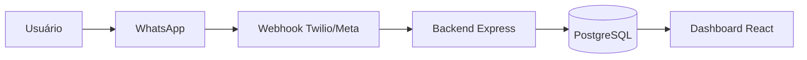

# FinanceBot


Sistema de organização financeira pessoal com entrada de gastos pelo WhatsApp e dashboard web com gráficos, metas e relatórios.

## Arquitetura



## Funcionalidades

- Parser em português para mensagens como `Gastei R$45,00 no supermercado`, `Pizza 38,50`, `Uber 22 transporte`.
- Webhook WhatsApp com respostas para registro, resumo mensal, resumo diário, categoria, meta e relatório.
- Autenticação com JWT e isolamento de dados por usuário.
- Dashboard com cards, gráfico donut, barras por semana, linha mensal e comparação com mês anterior.
- Transações com filtros, busca, exclusão e exportação CSV.
- Metas por categoria com alerta visual em 80% e 100%.
- Relatório mensal em JSON e PDF.
- Swagger em `/docs`.
- Docker Compose com PostgreSQL, backend e frontend.
- Testes unitários do parser e CI com GitHub Actions.

## Stack

- Backend: Node.js, Express, PostgreSQL, JWT, Joi, PDFKit, Twilio SDK.
- Frontend: React, Vite, TailwindCSS, Recharts, Lucide Icons.
- Infra: Docker, Docker Compose, GitHub Actions.

## Como rodar localmente

1. Crie o arquivo `.env` a partir do exemplo, caso ele ainda não exista:

```powershell
Copy-Item .env.example .env
```

2. Instale dependências:

```powershell
cd backend
npm install
cd ../frontend
npm install
```

3. Suba a API e a dashboard:

```powershell
cd ..
.\scripts\start-dev.ps1
```

4. Acesse:

- Dashboard: http://localhost:5173
- API: http://localhost:4000
- Swagger: http://localhost:4000/docs

Usuário demo:

- E-mail: `demo@financebot.dev`
- Senha: `password123`

Por padrão local, `DB_PROVIDER=pglite` usa um Postgres embutido em memória para facilitar a demonstração sem Docker ou administrador. Para persistência real, use Docker/PostgreSQL com `DB_PROVIDER=postgres`.

## Rodando com Docker

Se Docker Desktop estiver instalado:

```powershell
docker compose up --build
```

## Variáveis de ambiente

Consulte `.env.example`. As principais são:

- `DATABASE_URL`: conexão PostgreSQL.
- `JWT_SECRET`: segredo para assinar tokens.
- `FRONTEND_URL`: origem permitida no CORS.
- `PUBLIC_DASHBOARD_URL`: link enviado no comando `relatório`.
- `TWILIO_ACCOUNT_SID`, `TWILIO_AUTH_TOKEN`, `TWILIO_WHATSAPP_FROM`: credenciais Twilio.

Sem credenciais Twilio, o backend usa modo mock e imprime as respostas no console.

## Configurando WhatsApp com Twilio

1. Crie uma conta no Twilio e ative o WhatsApp Sandbox.
2. Configure suas credenciais locais:

```powershell
.\scripts\configure-whatsapp.ps1 `
  -TwilioAccountSid "ACxxxxxxxxxxxxxxxxxxxxxxxxxxxxxxxx" `
  -TwilioAuthToken "seu_auth_token" `
  -TwilioWhatsappFrom "whatsapp:+14155238886" `
  -PublicDashboardUrl "https://sua-url-publica"
```

3. Configure o webhook do sandbox para:

```text
POST https://sua-api.com/api/webhook/whatsapp
```

4. Garanta que o número do usuário esteja salvo em `users.whatsapp_number` no formato usado pelo Twilio, por exemplo:

```text
whatsapp:+5561998392309
```

5. Envie mensagens como:

```text
Gastei R$45 no supermercado
resumo
hoje
categoria alimentação
meta 1000 alimentação
relatório
```

Para testar sem Twilio, use o simulador local:

```powershell
.\scripts\send-whatsapp.ps1 -Message "Gastei R$45 no supermercado"
.\scripts\send-whatsapp.ps1 -Message "resumo"
```

## API principal

- `POST /api/auth/register`
- `POST /api/auth/login`
- `POST /api/webhook/whatsapp`
- `GET /api/transactions`
- `POST /api/transactions`
- `PUT /api/transactions/:id`
- `DELETE /api/transactions/:id`
- `GET /api/summary/monthly`
- `GET /api/summary/by-category`
- `GET /api/summary/daily`
- `GET /api/budgets`
- `POST /api/budgets`
- `GET /api/reports/monthly`
- `GET /api/reports/export-csv`

## Screenshots

Adicione imagens em `docs/screenshots/` depois de rodar a aplicação:

- `docs/screenshots/dashboard.png`
- `docs/screenshots/whatsapp-flow.png`

## Próximos incrementos

- WebSocket ou SSE para atualização da dashboard em tempo real.
- Edição inline de transações no frontend.
- Integração alternativa com WhatsApp Cloud API da Meta.
- Testes de integração com banco PostgreSQL em container.
